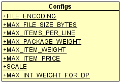
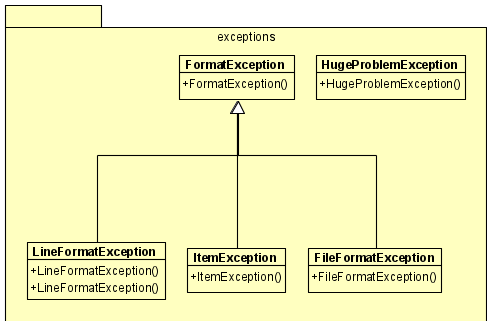
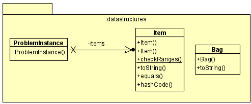
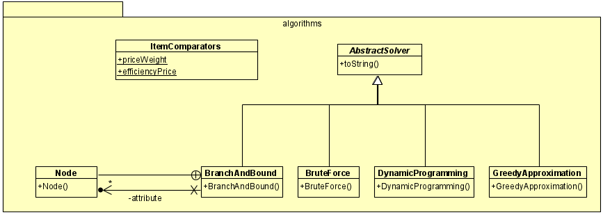

# Software Engineering Task

I received the following challenge as part of a software engineering task, and I decided to document some details about it. The details include:

0) Challenge description
1) Requirement analysis
2) Design decisions
3) Design
4) Implementation

Each item is described next.

## Challenge description

You want to send your friend a package with different items. You can choose from a number of `N` items. The items are numbered from 1 to `N`. Each one of these items has a given weight, and a given cost (in €), where the weights and costs of the items might be different. The package itself has a weight limit. The combined weight of the items you put in the package must not exceed the weight limit of the package, otherwise the package would be too heavy.
Your goal is to determine which items to put in the package so that the total cost of the items you put inside is as large as possible. In case the total cost the of the packaged items is the same for two sets of items, you should prefer the combination of items which has a lower total weight.

### Constraints

1. The maximum weight that a package can hold must be <= 100.
2. There may be up to 15 items you can choose from.
3. The maximum weight of an item should be <= 100.
4. The maximum cost of an item should be <= €100.

### Program Specification

Write a program, preferably in Java, which can be run on the command line in order to solve this problem. The program should take one command line argument, which contains the path to a text file. This text file should contain several lines, each line describing one test case for the problem.

Each line starts with the maximum weight of the package for this test case. It is followed by ` : ` and then the list of descriptions of the items available for packaging. Each item description contains, in parentheses, the item's number, starting at 1, its weight and its cost (preceded by a € sign).

In case of a constraint violation, your program should indicate this fact to the user, for example by throwing an exception with a descriptive message, allowing the user to address this problem.

#### Sample Input

A sample input file looks like this:

```
81 : (1,53.38,€45) (2,88.62,€98) (3,78.48,€3) (4,72.30,€76) (5,30.18,€9) (6,46.34,€48)
8 : (1,15.3,€34)
75 : (1,85.31,€29) (2,14.55,€74) (3,3.98,€16) (4,26.24,€55) (5,63.69,€52) (6,76.25,€75) (7,60.02,€74) (8,93.18,€35) (9,89.95,€78)
56 : (1,90.72,€13) (2,33.80,€40) (3,43.15,€10) (4,37.97,€16) (5,46.81,€36) (6,48.77,€79) (7,81.80,€45) (8,19.36,€79) (9,6.76,€64)
```

#### Sample Output

The solution for each test case should be printed out on a single line. On this line you should list the item numbers of the individual items to be put in the package to solve the problem. The numbers should be separated by commas. If no combination of items matches the requirements, the output should be a single `-`.

The sample output for the sample input file above should look like this:

```
4
-
2,7
8,9
```

## Requirement analysis
First, we note that the problem belongs to a family of famous problems called [knapsack problems](https://en.wikipedia.org/wiki/Knapsack_problem). There are actually [several variants](https://en.wikipedia.org/wiki/List_of_knapsack_problems) of this problem. This one has the following characterizations:

1. **It's a 0-1 knapsack:** Each item is either taken or left.
2. **It's doubly optimized (terminology mine):** If two subsets of items have equal costs, the one which is lighter (has lower weight) prevails.

The 0-1 knapsack problem is an [NP-complete](https://en.wikipedia.org/wiki/NP-completeness) problem, meaning there is currently no known *efficient* (i.e., polynomial-time) algorithm to solve it. However,

1. It is [weakly NP-complete](https://en.wikipedia.org/wiki/Weak_NP-completeness), meaning it has a [pseudo-polynomial-time algorithm](https://en.wikipedia.org/wiki/Pseudo-polynomial_time). In layman's terms, if the numerical values involved in the problem definition (such as the weights) are small enough, the problem can be solved in polynomial time. This is often done via [dynamic programming](https://en.wikipedia.org/wiki/Dynamic_programming).

2. A variation where we can take fractions of an item (e.g., half of item 3) can be solved efficiently using a [greedy algorithm](https://en.wikipedia.org/wiki/Greedy_algorithm): Items are first sorted in decreasing **efficiency** (= cost / weight). Whole items are taken in order, until the knapsack can't carry any more item. Then, a fraction of the most efficient remaining item is taken. This approach cannot be used for 0-1 knapsacks. However, it can be used as an approximation algorithm. There's a technicality, which allows this simple heuristic to perform arbitrarily bad. But with proper adjustments, we can get a 1/2 approximation: If the maximum possible cost is OPT, the heuristic guarantees a subset of items with cost at least OPT/2.

3. The problem belongs to [FPTAS](https://en.wikipedia.org/wiki/Polynomial-time_approximation_scheme) class of problems. This means that there exist an efficient approximation which can get arbitrarily close to the solution. More formally, for any 0-1 knapsack problem P and any ε>0, we can get a solution whose cost is at least (1-ε)OPT, while running in time polynomial in (|P|, 1/ε), where |P| is the size of the problem.

We have a plethora of algorithms to choose from. In fact, looking at the problem description, the size of the problem |P| is so small that even brute forcing the solution is viable. An engineer would choose the "optimum" algorithm tailored to the problem at hand. So, here's a few questions that a software engineer would ask from the client:

1. Is this a toy example, or the parameters for the real-world problem are as small?
2. Do weights always have up to two digits after the decimal point?
3. Are costs always whole numbers?
4. What is the encoding of the input file?
5. What is the maximum size of the input file?
6. How do you like to treat an input file which is malformed, after showing an error: Continue processing further lines, or stop the program?

Ask any software engineer worth his while, and they will tell you how reliable clients' responses are. Businesses grow, requirements change, and that's not client's fault. Currently, the client needs N=15 items tops. Tomorrow, they may need 100. And it will be meaningless for them when you say you'll need to write the software anew to address that change.

So, no - brute force is not a viable option. Not at least when we are writing a piece of software which takes engineering requirements seriously. But we may use brute force to test other algorithms on small instances.

## Design principles and decisions
Here's how we addressed questions in the previous section:

1. Yes, this is a toy example. The real-world solution may require much larger parameters.
2. That's unknown. Write a solution which handles arbitrary number of digits after decimal point.
3. No, costs can be positive real numbers. Handle them like weights.
4. Default to UTF-8, but let that be configurable.
5. Put a meaningful amount in configuration file. While it is possible to handle files of any size (by reading them partially or mapping views onto memory), such a change is not substantial and can be postponed.
6. Continue processing further lines.

The other decisions were as follows:

1. **Exploit immutability:** [Effective Java (EJ)](https://learning.oreilly.com/library/view/effective-java-3rd/9780134686097/), item 17 states "minimize mutability." There are so many good reasons to use immutable classes. For this project, it helped a lot when objects where passed between methods. Had it not been for immutability, it would have been possible for one method to inadvertently modify the object. It is a very helpful to annotate classes with [JCIP annotations](https://github.com/stephenc/jcip-annotations): For instance, immutable classes are annotated with `@Immutable`.

2. **Use `final` classes:** This is a direct result of immutability, but even if a class is supposed to have subclasses, one can define it as `abstract` to prevent creation of instances. One the surface, this might seem contrary to the [open–closed principle](OCP), but it isn't. In fact, **EJ Item 18** explains how *inheritance violates encapsulation*, and that it's better to use composition over inheritance. Also, **EJ Item 19** lays down principles for designing a class for inheritance:

> The only way to test a class designed for inheritance is to write subclasses. If you omit a crucial protected member, trying to write a subclass will make the omission painfully obvious. Conversely, if several subclasses are written and none uses a protected member, you should probably make it private. Experience shows that three subclasses are usually sufficient to test an extendable class. One or more of these subclasses should be written by someone other than the superclass author.

The only class we designed for inheritance was `AbstractSolver.java`, which has four subclasses: `BranchAndBound`, `BruteForce`, `DynamicProgramming` and `GreedyApproximation`.

3. **Minimize access:** The member fields and member methods should have the minimal access. To quote **EJ Item 15** makes these statements:

> The single most important factor that distinguishes a well-designed component from a poorly designed one is the degree to which the component hides its internal data and other implementation details from other components. A well-designed component hides all its implementation details, cleanly separating its API from its implementation. Components then communicate only through their APIs and are oblivious to each others’ inner workings. This concept, known as information hiding or encapsulation, is a fundamental tenet of software design.

> For members of public classes, a huge increase in accessibility occurs when the access level goes from package-private to protected. A protected member is part of the class’s exported API and must be supported forever. Also, a protected member of an exported class represents a public commitment to an implementation detail (Item 19). The need for protected members should be relatively rare.

While most members in our classes could be `private`, we made their accessibility default (a.k.a. package-private) to facilitate testing in a more modular way (see next).

4. **Use test-driven development (TDD):** Writing tests were a bliss. One can modify the design or the implementation, and in a blink of eye verify if it breaks anything. TDD is very useful, especially for agile development where refactoring occurs frequently.

5. **Test coverage:** Once unite/integration tests are in place, one can check the coverage of those tests. Anything below 100% coverage shows some statements are not covered during the tests. This saved me from a possible bug: I mistakenly assumed [`Matcher.groupCount()`](https://docs.oracle.com/en/java/javase/14/docs/api/java.base/java/util/regex/Matcher.html#groupCount()) returns 3 in the following snippet, because the capture group matches three times:

```java
Pattern p = Pattern.compile("^(a)+$");
p.matcher("aaa").groupCount()
```

However, the correct answer is 1. Had it not been for testing coverage, an edge case corresponding to the above mistake wouldn't have been tested. As a result, the issue could have propagated through the code.


6. Use `BigDecimal` to hold real numbers. `float` and `double` are notorious for handling real numbers, and they are forbidden for storing monetary values (due to rounding issues). Unfortunately, using `BigDecimal` reduced the code readability, since Java does not support operator overloading. Therefore, operations and relations are implemented via methods:

```java
BigDecimal a = new BigDecimal("12.345");
BigDecimal b = new BigDecimal("6.78");
BigDecimal c = a.subtract(BigDecimal.TEN).multiply(b);
...
if(c.compareTo(d) > = 0)
...
```

7. **Use a linter:** Linters helps in following best practices, as well as a unified convention. I used [SonarLint plugin for IntelliJ IDEA](https://www.sonarlint.org/intellij/). Among other things, it computed the [Cognitive Complexity™](https://www.sonarsource.com/resources/white-papers/cognitive-complexity.html) of the code. In a few cases where the method complexity was beyond the allowable 15, it warned me and I simplidied the code. The result was much better!

## Design

### Packages

The project uses the following packages. They reside in the top-level package `io.sadeq`:

1. `exceptions`: Contains custom exception classes.
2. `utils`: Contains utility classes.
3. `datastructures`: Contains data structures.
4. `algorithms`: Contains algorithms.

### Classes
The simplest class is the `Configs` class, which resides in the top-level package. It contains configurations such as the default file charset. Each configuration is documented within the class.



The top-level package also includes the `Main` class, which contains the program entry point.

The classed within the `exceptions` package are depicted below:



1. `HugeProblemException` is thrown if the problem instance is greater than some value specified in the `Configs` class.
2. `FormatException` is a super class for various exceptions thrown while parsing the input file.
3. `FileFormatException` is thrown when the input file is empty or is larger than some value specified in the `Configs` class.
4. `LineFormatException` is thrown when a line of the input file is malformed. For instance, it is not in the format `a:b`.
4. `ItemFormatException` is thrown when an item on a specific line is malformed. For instance, it is not in the format `a,b,c`.

The classed within the `utils` package are depicted below:


1. `RegexPatterns` contains the regular expression patterns used by other classes. The patterns are static members of the class, and are compiled for increased efficiency.
2. `FileParser` loads the input file, and reads it line-by-line. Each line is passed to an instance of the class `ProblemInstance` (explained next) for processing.

The classed within the `datastructures` package are depicted below:



1. `ProblemInstance` reads an input line as a `String`, and parses it into a maximum weight (`BigDecimal maxWeight`) and a list of items (`List<Item> items`). The class `Item` is explained next. It also keeps a mapping `Map<Integer, Item> map` for fast retrieval of items given their label.

2. `Item` parses triples `a,b,c`, and stores them as the triple `int number, BigDecimal weight, BigDecimal price`.

3. `Bag` represents a subset of items. It receives the indices (or labels) of items, and computes basic information such as the total cost and the total weight of the items in the subset.

The classed within the `algorithms` package are depicted below:



1. `ItemComparators`: Keeps comparators used by various algorithms. For instance, `priceWeight` is a comparator which first compares two items using their price, and if the prices are equal compares their weight. Java provides an excellent API for writing such comparators:

```java
// If their price is equal, the lighter one wins
public static final Comparator<Item> priceWeight =
        Comparator.comparing(Item::getPrice).thenComparing(Item::getWeight, Comparator.reverseOrder());
```

2. `AbstractSolver` is the main class marked for inheritance. It has the following `abstract` method:
```java
protected abstract SortedSet<Integer> solve(ProblemInstance problemInstance);
```
Various algorithms which want to solve the problem can implement this method. The constructor of  `AbstractSolver` receives an instance of `ProblemInstance`, calls `solve`, and initializes the field `Bag bag` given the response.

3. `BruteForce` is the simplest extension of `AbstractSolver`, and solves the problem by exhaustively searching the solution space. Each item can be either in the solution or not. So, for `N` items, there are 2<sup>N</sup> possible solution. For each solution, the cost and weight are computed, and the winner is the one with highest cost (and if several such solutions exist, the one with least weight). For `N = 15`, there are at most `32768` possible solutions. The algorithm needs only a few milliseconds (on a Surface Pro 7 laptop) to run. This class is used in unit tests to check the correctness of other algorithms on thousands of random problem instances.

4. `GreedyApproximation` uses the greedy approach explained previously, with one twist: It greedily picks a subset of items until the weight constraint allows no more. It then compares the cost of this subset with the item with maximum cost, and the winner is returned. It can be shown that if this comparison is not made, the solution can be arbitrarily bad. However, the comparison allows a 1/2-approximation scheme. The unit tests show that this approximation factor is achieved over thousands of random problem instances.

> While `GreedyApproximation` does not provide an exact solution, it performs very well on most instances. Even for those instances where the answer is suboptimal, the weight of the subset is often substantially lower. Furthermore, the algorithm only needs to sort items once, and then iterate over them (a total cost of `O(N log N)`), which is much better than other algorithms (for general cases, the worst case is conjectured to be exponential in `N`). At some point, the client may decide that the approximation is good enough, and is worth switching to in favor of faster running time.

5. `DynamicProgramming` is a pseudo-polynomial algorithm: It is polynomial time in the value `W`, which denotes the number of possible weights (if the weights are fractional, we can multiply them by a common factor so that they are all integers.) It works by trading space for time: A large table is used to memoize state for subproblems. For this specific problem, the parameters are such that the running time of `DynamicProgramming` is worse than that of `BruteForce`, and it even uses much more RAM.

> It would have been possible to implement memoization based on costs rather than weights.

6. `BranchAndBound` is similar to `BruteForce`, but it uses heuristics so that only plausible solutions in the solution space are traversed. The order of traversal is also optimized. The solution space can be seen as a binary tree. For node `i`, the left edge denotes leaving the `i+1` item, while the right edge denotes taking it. For each node, a *bound* is computed using the heuristic explained previously, and assuming that items can be partially taken. A subtree is pruned if (1) it violates the weight constraint, (2) if its bound is less than the current maximum cost achieved by traversing other nodes of the tree.

Notice that `BranchAndBound` is currently the default solver algorithm, but it can be changed in the `Main` class:

```java
List<AbstractSolver> lst = fp.parse().parallelStream()
                .map(BranchAndBound::new)
                .collect(Collectors.toList());
```

Also, note how `parallelStream` is used to split the task on multiple CPU cores. That is, each problem instance is run by the solver on its own CPU core.

## Running

You can use the provided `run.bat` file to compile and run the project. Just correct the path to `mvn` script, and you're good to go:

```shell
@echo off

C:\Tools\mvn\bin\mvn -q compile exec:java -Dexec.args=%1
```

Notice that Maven script is silenced by passing `-q` to it; you can remove that to see messages of interest. To run, just give the file path to the BATCH file.

Without file path:

```shell
run.bat
```
```text
Please give the correct path to test cases as an argument.
```

With file path:

```shell
run.bat C:\tmp\items.txt
```
```text
Line #2: Error - Line cannot be blank. This line was discarded.
Line #4: Error - Max package weight 800 exceeds 100. This line was discarded.
------
4
ERR
-
ERR
2,7
8,9
1,2,6
```

For completeness, here's the contents of `C:\tmp\items.txt`:

```text
81:(1,53.38,€45)(2,88.62,€98)(3,78.48,€3)(4,72.30,€76)(5,30.18,€9)(6,46.34,€48)

8:(1,15.3,€34)
800:(1,15.3,€34)
75:(1,85.31,€29)(2,14.55,€74)(3,3.98,€16)(4,26.24,€55)(5,63.69,€52)(6,76.25,€75)(7,60.02,€74)(8,93.18,€35)(9,89.95,€78)
56:(1,90.72,€13)(2,33.80,€40)(3,43.15,€10)(4,37.97,€16)(5,46.81,€36)(6,48.77,€79)(7,81.80,€45)(8,19.36,€79)(9,6.76,€64)
60:(1,30,€30)(2,20,€20)(3,20,€20)(4,10,€10)(5,20,€10)(6,10,€20)(7,30,€30)(8,10,€10)(9,30,€30)(10,28,€28)(11,2,€2)
```
